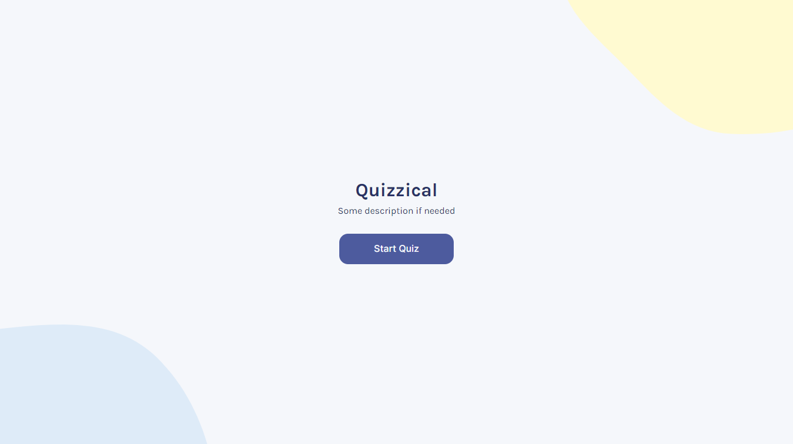
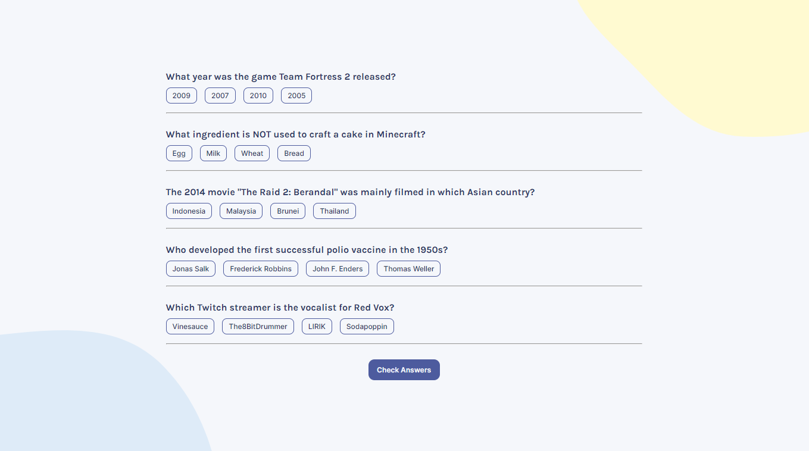
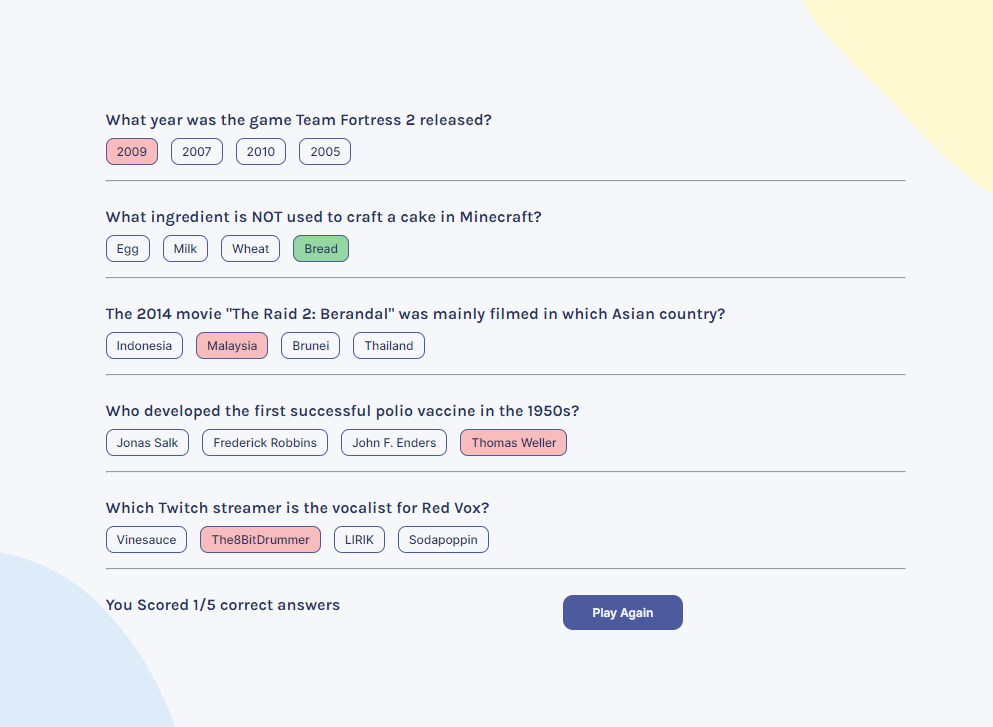
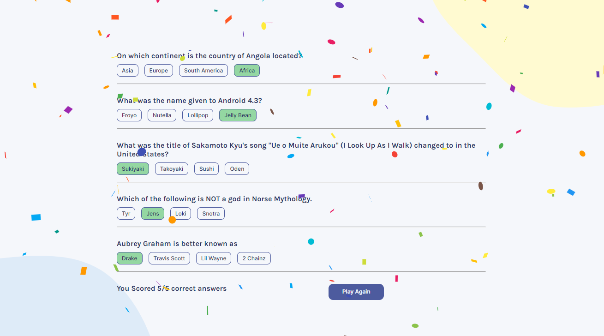

# [Quizzical](https://fanciful-cucurucho-60dab9.netlify.app/)
General Trivia Game built using React.

Game fetches 5 multiple choice questions from "Open Trivia Database" for each game. User can select only one choice from the available options and submit their responses once they are done.
Upon which the game will evaluate the number of correct responses and ask if the user wants to play again.

## UI

- Home Screen

- Game Page

- Check Answers

- Successfully answering all questions correctly
